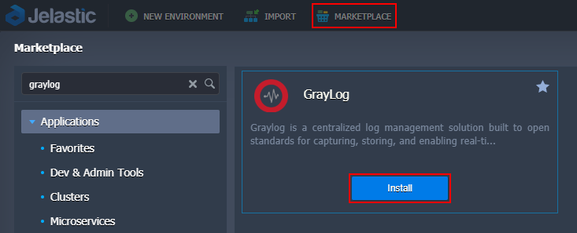
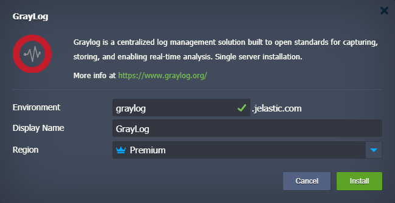

# Graylog Enterprise Log Management

**[Graylog](https://www.graylog.org/)** is a modern solution for centralized log management that is built to make analysis lightning fast and extremely efficient. Graylog utilizes flexible and cost-efficient architecture to deliver a better user experience. It is an essential tool to help you solve security, compliance, operational, and DevOps issues.

## Graylog Deployment

Click the **Deploy** button below, specify your email address within the widget, choose one of the [Jelastic Public Cloud providers](https://jelastic.cloud/), and click **Install**.

Herewith, if you already have the account, you can import the link of the application [manifest](https://github.com/jelastic-jps/graylog/blob/master/manifest.jps) within the Jelastic PaaS dashboard or initiate the installation from the **Marketplace > Dev & Admin Tools > GrayLog**.

Within the opened confirmation window, you can additionally provide the _Environment_ name, _[Display Name](https://docs.jelastic.com/environment-aliases)_, and _[Region](https://docs.jelastic.com/environment-regions)_ (if available).

That’s all! The platform will automatically perform all the actions required to install your Graylog server.

## Getting Started

If you are not familiar with Graylog, the steps below will help you to get started:

* **[send logs](https://gettingstarted.graylog.org/assets/v2/guides/1-first_messages.html)** - configure your services (applications) to send logs to your Graylog server
* **[basic searches](https://gettingstarted.graylog.org/assets/v2/guides/2-do_something.html)** - learn about searches in Graylog
* **[create a dashboard](https://gettingstarted.graylog.org/assets/v2/guides/3-dashboards.ftl)** - optimize information analysis thorough creation of personalized dashboards
* **[configure alerts](https://gettingstarted.graylog.org/assets/v2/guides/4-alerts.ftl)** - receive immediate alerts based on the set condition

Refer to the [official Graylog documentation](http://docs.graylog.org/) for more information.
